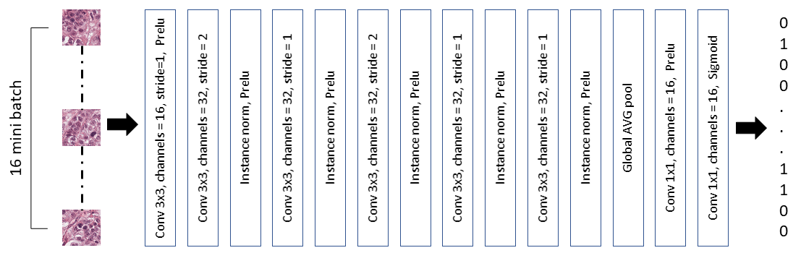

# Mitosis ICRP2012 

Necessary libraries:
<ul>
<li>Numpy</li>
<li>PIL</li>
<li>matplotlib</li>
<li>torch</li>
<li>skimage</li>
<li>pandas</li>
</ul>

### Flow chart
Input image &#8594; Normalization &#8594; sliding window crop (512,512) &#8594; segmentation model &#8594; segmentation extraction (120,120)&#8594; classification model &#8594; final results

### Training
#### Segnmentation
Adam, 1e-4 lr, no lr decay, 20k epochs, normalized loss + global maximum loss

#### Classification
Adam, 3e-4 lr, no lr decay, 5k epochs

### Evaluation
TP: 188  |  FP: 29   |  FN: 36   |   F: 0.8526   |   R: 0.8392857142857143   |   P: 0.8663594470046083

### Classifier model

### Classifier model

