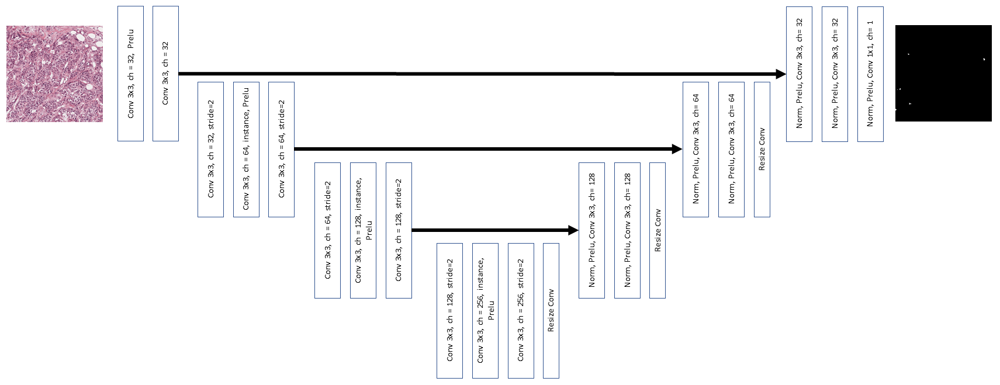

# Mitosis ICRP2012 

Necessary libraries:
<ul>
<li>Numpy</li>
<li>PIL</li>
<li>matplotlib</li>
<li>torch</li>
<li>skimage</li>
<li>pandas</li>
</ul>

### Flow chart
Input image &#8594; Normalization &#8594; sliding window crop (512,512) &#8594; segmentation model &#8594; segmentation extraction (120,120)&#8594; classification model &#8594; final results

### Training hyper-params
#### Segnmentation
Adam, 1e-4 lr, no lr decay, 20k epochs, normalized loss + global maximum loss
#### Classification
Adam, 3e-4 lr, no lr decay, 5k epochs

### Pre-processing
Images are normlizaed using the following method \
. Macenko M, Niethammer M, Marron JS, Borland D, Woosley JT,
Guan X, Schmitt C, Thomas NE (2009) A method for normalizing
histology slides for quantitative analysis. In: IEEE International
Symposium on Biomedical Imaging: From Nano to Macro, 2009.
ISBI’09, pp 1107–1110. IEEE

In the evaluation folder, original images end with this formate'A00_00.bmp', Normlized images end with this formate 'A00_00_n.png'

### Augmentation
<ul>
<li>HorizontalFlip(p=0.5)</li>
<li>VerticalFlip(p=0.5)</li>
<li>RandomRotate90(p=0.5)</li>
<li>Downscale_Upscale(interpolation=cv2.INTER_CUBIC, p=0.5)</li>
</ul>

### Los Functions
Segmentation : loss = BCE pixelwise(X,y) + BCE AVG(Sigmoid(X),labels)
classification : loss = BCE(outs,labels)

### Evaluation
TP: 188  |  FP: 29   |  FN: 36   |   F: 0.8526   |   R: 0.8392857142857143   |   P: 0.8663594470046083

### Classifier model

### Classifier model

